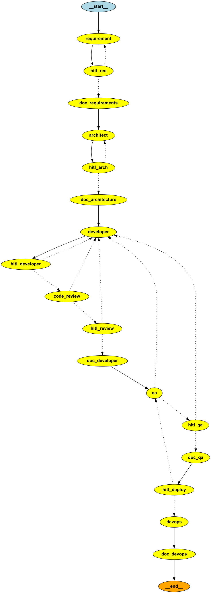

# Agentic SDLC

Agentic SDLC is a local-first platform that turns a software idea into a structured delivery flow: requirements, architecture, code, tests, documentation, and deployment assets. It adds human approval at the important checkpoints so you stay in control instead of handing everything over to automation.

This project is built for people who want to try an AI-assisted software delivery workflow on their own machine, even if they are not deeply technical.



## What This Project Does

You give the system a product idea in plain language. The platform then moves through a full software delivery pipeline:

1. It turns your idea into requirements.
2. It designs a proposed architecture.
3. It generates a codebase and tests.
4. It reviews the generated code.
5. It runs QA checks.
6. It prepares deployment files and can open a GitHub pull request.

At several points, the system pauses and asks for human approval before it continues.

## Why It Matters

Many AI coding demos stop at "generate some code." This project goes further. It tries to model the real software delivery process, including reviews, test runs, documentation, and deployment handoff.

That makes it useful for:

- learning how agent-based software workflows can be structured
- testing AI-assisted delivery pipelines locally
- experimenting with human-in-the-loop approval flows
- understanding how LangGraph, FastAPI, and Streamlit can work together in one product

## Quick Start

### 1. What you need

- Python 3.12 or newer
- `uv` for dependency management
- an OpenAI API key
- optional: a GitHub personal access token if you want pull request creation
- optional: a Context7 API key if you want documentation-backed code generation and review

### 2. Install the project

```bash
git clone <your-repo-url>
cd agentic-sdlc
uv sync
```

### 3. Configure your environment

Copy `.env.example` to `.env` and fill in the values you want to use.

Required:

- `OPENAI_API_KEY`

Common optional settings:

- `GITHUB_PERSONAL_ACCESS_TOKEN`
- `GITHUB_REPO_OWNER`
- `GITHUB_REPO_NAME`
- `CONTEXT7_API_KEY`
- `LLM_MODEL`
- `LOG_LEVEL`

Simple explanation of the main settings:

| Variable | What it is used for |
|---|---|
| `OPENAI_API_KEY` | Required for the agents to generate and review content |
| `LLM_MODEL` | Lets you choose a different OpenAI model |
| `GITHUB_PERSONAL_ACCESS_TOKEN` | Allows the DevOps step to push files and open a pull request |
| `GITHUB_REPO_OWNER` / `GITHUB_REPO_NAME` | Tells the project which GitHub repository to target |
| `CONTEXT7_API_KEY` | Enables documentation-backed context for code generation and review |
| `USE_CONTEXT7` | Turns Context7 support on or off |
| `LOG_LEVEL` | Controls how much detail is written to logs |

### 4. Start the backend API

Open a terminal and run:

```bash
uvicorn src.api.app:app --reload --port 8000 --reload-dir src
```

### 5. Start the dashboard

Open a second terminal and run:

```bash
streamlit run src/dashboard/streamlit_app.py
```

### 6. Open the app in your browser

Go to `http://localhost:8501`.

From there:

1. Enter a software idea in the sidebar.
2. Start a run.
3. Review the generated output at each approval step.
4. Approve or reject to move the pipeline forward.

## What Happens During a Run

Here is the simple version of the workflow:

- **Requirements:** the system turns your idea into a clearer list of goals and constraints.
- **Architecture:** it proposes a technical design for the solution.
- **Development:** it generates code, tests, and project files.
- **Code Review:** it checks the generated code for issues.
- **QA:** it runs `pytest` against the generated project.
- **Deployment:** it prepares deployment files and can push the result to GitHub.

The project uses a LangGraph workflow behind the scenes, while the dashboard shows progress and pauses for approval when needed.

## What the Project Creates

Each run can produce:

- a generated project under `workspace/<project-name>/`
- source files and tests
- phase-by-phase documentation in Markdown and PDF
- test results from the QA step
- checkpoint state in `.checkpoints/sdlc.sqlite`
- logs in `logs/`
- Docker and CI files for the generated project
- a GitHub pull request if GitHub settings are configured correctly

Typical output locations:

| Path | What you will find there |
|---|---|
| `workspace/` | Generated projects and phase documents |
| `.checkpoints/` | Workflow checkpoints, memory, and local state |
| `logs/` | Run logs and debugging information |
| `src/dashboard/` | Streamlit user interface |
| `src/api/` | FastAPI backend |
| `src/pipelines/` | Graph workflow and state management |
| `src/agents/` | Agent implementations for each SDLC step |

## Main Project Areas

If you want a light contributor overview, these are the parts that matter most:

- `src/api` handles run creation, resume actions, state lookup, and rewind endpoints.
- `src/dashboard` provides the Streamlit interface for launching runs and reviewing checkpoints.
- `src/pipelines/graph.py` defines the LangGraph workflow and routing logic.
- `src/agents` contains the individual agents for requirements, architecture, development, review, QA, DevOps, and docs.
- `src/tools` contains helper utilities such as the pytest runner and supporting clients.

Helpful supporting docs:

- [architecture.md](architecture.md)
- [agents.md](agents.md)
- [skills.md](skills.md)

## Top 3 Current Issues for Users

1. **Setup is still more complex than it should be.** You need to run two local services and manage API keys before the project becomes useful.
2. **Generated output still needs human judgment.** The workflow is helpful, but it is not a one-click production system. Reviews and retries are part of normal use.
3. **Some advanced features depend on external services.** GitHub PR creation and documentation-backed generation are much better when extra credentials and services are configured.

## Top 3 Current Issues for Contributors

1. **A few important files are doing a lot of work.** Files like `src/pipelines/graph.py` and the dashboard app are central and can become harder to maintain as the project grows.
2. **External integrations increase maintenance cost.** OpenAI, Context7, GitHub, Streamlit, and LangGraph all move independently, so integration drift is a real engineering concern.
3. **End-to-end validation is still the biggest long-term quality gap.** There are project tests, but the full workflow still depends heavily on real services, retries, and manual verification.

## Future Improvements

These are the most valuable next improvements for the project:

- add a one-command local startup flow so non-technical users do not need to manage multiple terminals
- improve first-run onboarding with a clearer setup wizard or guided environment check
- strengthen end-to-end test coverage for the full pipeline, including pause/resume and retry behavior
- split large workflow and UI files into smaller units to make the codebase easier to extend
- improve generated-project evaluation so the system can measure output quality more consistently
- make deployment targets more flexible beyond the current GitHub-centered flow

## API Endpoints

If you want to call the backend directly, these are the main endpoints:

- `POST /runs` to start a run
- `POST /runs/{thread_id}/resume` to approve or reject a paused step
- `GET /runs/{thread_id}/state` to fetch the latest run state
- `GET /runs/{thread_id}/checkpoints` to list checkpoints
- `POST /runs/{thread_id}/rewind` to rewind a run to an earlier checkpoint
- `GET /health` for a simple health check

## License

MIT
